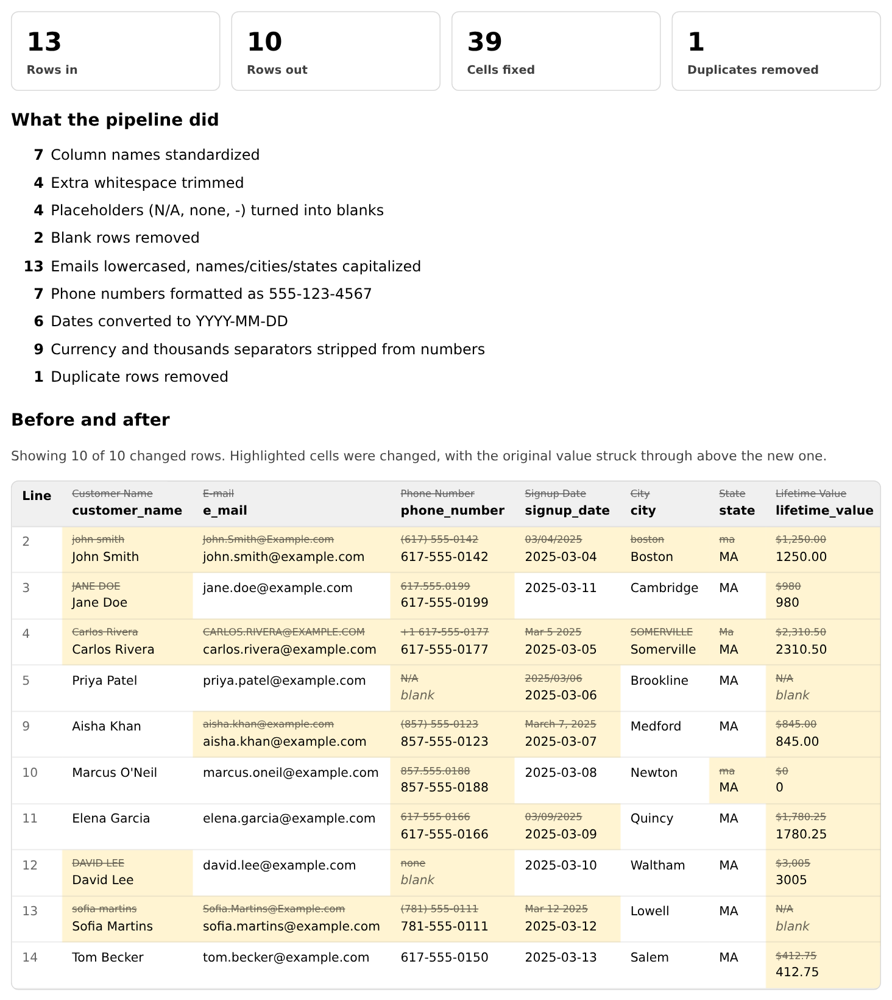

# AWS IaC Pipeline


A full-stack infrastructure-as-code pipeline: **Terraform** provisions AWS infrastructure — networking, a web server, and a private Postgres database — **Ansible** deploys a **React/TypeScript** frontend and a **Flask** backend onto it, and every deploy is gated by a real test suite and a security scan, all automated through **GitHub Actions**.

The app it deploys is a **CSV data-cleaning tool**: upload a messy spreadsheet and a pandas pipeline standardizes names, dates, phone numbers, currency and duplicates, then shows exactly what it changed, with the original value struck through beside each fix.

**Live demo:** http://ec2-54-147-114-220.compute-1.amazonaws.com — click **Try the sample data** to see it work without uploading anything. *(A personal-project instance on a free-tier server. AWS assigns its address, which changes whenever the instance is replaced, so if the link is down, `terraform output instance_public_dns` gives the current one.)*



## Contents

- [Architecture](#architecture)
- [The app](#the-app)
  - [Data-cleaning tool](#data-cleaning-tool)
- [Repository structure](#repository-structure)
- [Deploying it yourself](#deploying-it-yourself)
- [Running the tests locally](#running-the-tests-locally)
- [CI/CD pipeline](#cicd-pipeline)
- [Security design notes](#security-design-notes)
- [Known limitations](#known-limitations)
- [Teardown](#teardown)

## Architecture

```
                              ┌──────────────────────────────────────────────────┐
                              │                  AWS (us-east-1)                   │
                              │                                                     │
                              │   VPC (10.0.0.0/16)                                 │
                              │   ├── Public Subnet   (10.0.1.0/24, AZ-a)           │
                              │   │    └── EC2 t3.micro — IMDSv2 enforced            │
                              │   │         ├── nginx                                │
                              │   │         │    ├── serves the React SPA (static)   │
                              │   │         │    └── reverse-proxies /api/* + /health│
                              │   │         └── gunicorn → Flask app                 │
                              │   │              (IAM role → read-only access to     │
                              │   │               its own DB password in SSM)        │
                              │   │                                                  │
                              │   └── DB Subnet       (10.0.2.0/24, AZ-b)            │
                              │        └── RDS Postgres 16 — private, only reachable │
                              │            from the web instance's security group    │
                              │                                                       │
                              │   SSM Parameter Store ── DB password (SecureString)  │
                              │   S3 bucket  ── Terraform remote state (encrypted)   │
                              │   DynamoDB   ── Terraform state locking              │
                              └──────────────────────────────────────────────────────┘
                                                    ▲
                                                    │ plan / apply / deploy
                              ┌──────────────────────────────────────────┐
                              │              GitHub Actions CI             │
                              │                                             │
                              │   test ──┐                                 │
                              │   test-frontend ──┼──▶ terraform ──▶ deploy │
                              │   security-scan ──┘     (plan/apply)  (Ansible) │
                              └──────────────────────────────────────────┘
```

## The app

**Backend** — a small Flask API:

| Route | Purpose |
|---|---|
| `GET /health` | Liveness check |
| `GET /api/status` | Hostname, uptime, version — for debugging a live deploy |
| `GET /api/visits` | Reads/writes Postgres — the app talking to a real relational database |
| `GET /api/visits/summary` | Aggregates the same visits table with `GROUP BY date_trunc('hour', ...)` — total, last-24h count, and a zero-filled 24-hour time series |
| `POST /api/clean` | Data-cleaning tool: upload a CSV (multipart `file`, optional JSON `options`) and get back a report of what was fixed, a before/after preview, and the cleaned CSV. Stateless — processed in memory, never stored |
| `GET /api/clean/sample` | A deliberately messy CSV so the tool can be tried without uploading anything |

**Frontend** — a React + TypeScript single-page app (built with Vite) that calls the API above and renders it live: the data-cleaning tool (below), backend status, a running visit counter, and a visit-analytics panel with a hand-rolled SVG bar chart (no charting library — kept the bundle small for a 24-bar sparkline). Typed end-to-end with TypeScript interfaces matching the API's JSON shape.

The database password is never typed by a human, never committed, and never passed through CI logs. It's auto-generated by Terraform (`random_password`), stored in SSM Parameter Store as a `SecureString`, and fetched by the app itself at runtime using the EC2 instance's IAM role — scoped to read only that one parameter.

### Data-cleaning tool

The page's main feature. Upload a CSV (or click **Try the sample data**) and a pandas pipeline standardizes it and reports exactly what it changed. Every step can be switched on or off, and the cleaning re-runs as you toggle them.

| Step | Example |
|---|---|
| Column names | `First Name` → `first_name` |
| Whitespace | `"  Carlos   Rivera "` → `"Carlos Rivera"` |
| Placeholders | `N/A`, `none`, `-` → blank |
| Capitalization | emails lowercased, `JANE DOE` → `Jane Doe`, `ma` → `MA` (mixed case like `McDonald` is left alone) |
| Phones | `(617) 555-0142` → `617-555-0142` |
| Dates | `Mar 5 2025`, `03/04/2025` → `2025-03-05`, `2025-03-04` (slashes are read month-first) |
| Numbers | `$1,250.00` → `1250.00` |
| Duplicates | checked *after* cleaning, so `john smith` and `John Smith` match |
| Median fill | opt-in only, because it invents data |

Design choices worth knowing:

- **Everything is processed as text**, so ZIP codes and IDs keep their leading zeros (`02134` stays `02134`).
- **Columns are only rewritten when most of their cells actually parse.** A column named `event_date` full of free text is left alone rather than mangled.
- **Duplicates are detected after cleaning**, so rows that differed only by formatting are caught. That also means switching off a formatting step can change how many duplicates are found.
- **The preview shows what changed.** Each fixed cell appears with its original value struck through above the new one, along with its line number in your original file.
- **Limits:** 2 MB, 5,000 rows and 50 columns per file. Nothing is stored; the file is cleaned in memory and sent straight back. nginx's request-size limit is raised to match, because its 1 MB default would reject larger uploads before Flask ever saw them.

Try the API directly:

```bash
curl -s http://<host>/api/clean/sample -o sample.csv
curl -s -F "file=@sample.csv" -F 'options={"fill_numeric_median": true}' http://<host>/api/clean
```

The available options are listed in `DEFAULT_OPTIONS` in `app/cleaner.py`. The engine has no Flask or database dependency, which is why it can be unit-tested on its own (`app/tests/test_cleaner.py`). The React UI is `frontend/src/DataCleaner.tsx`.

## Repository structure

| Path | Purpose |
|---|---|
| `providers.tf` | AWS + random provider configuration |
| `variables.tf` | Input variables (region, instance type, SSH key, allowed IP) |
| `network.tf` | VPC, subnets (public + DB), routing, security groups |
| `compute.tf` | AMI lookup, SSH key pair, EC2 instance (IMDSv2 enforced) |
| `storage.tf` | S3 bucket (encrypted, public access blocked) |
| `database.tf` | RDS Postgres instance, auto-generated password, SSM parameter |
| `iam.tf` | Least-privilege IAM role letting the instance read its own DB password |
| `state-locking.tf` | DynamoDB table for Terraform state locking |
| `backend.tf` | Remote state configuration (S3 + DynamoDB) |
| `outputs.tf` | Instance IP, DB connection details (non-secret), bucket name |
| `templates/user_data.sh.tpl` | Cloud-init script, baked into the instance at boot, that appends the CI deploy key to `authorized_keys` — see "CI SSH access" below |
| `app/` | Flask backend (`app.py`), the pandas data-cleaning engine (`cleaner.py`), and a pytest suite (`tests/`) |
| `frontend/` | React + TypeScript frontend (Vite), including the data-cleaning UI (`src/DataCleaner.tsx`), + vitest test suite |
| `ansible/` | Playbook that deploys both frontend and backend under nginx/gunicorn, plus the nginx config (including the upload-size limit) |
| `.github/workflows/terraform.yml` | The full CI/CD pipeline |
| `docs/` | The screenshot shown at the top of this README |

## Deploying it yourself

These steps stand up the real infrastructure in your own AWS account. It uses free-tier-eligible resources, but check your account's pricing first. To just run the tests, skip to the next section.

1. Install [Terraform](https://developer.hashicorp.com/terraform/downloads), the [AWS CLI](https://aws.amazon.com/cli/), [Ansible](https://docs.ansible.com/ansible/latest/installation_guide/index.html), and [Node.js](https://nodejs.org/)
2. `aws configure` with an IAM user's access key (scoped, not root)
3. Copy `terraform.tfvars.example` to `terraform.tfvars` and fill in your SSH public key and IP
4. `terraform init && terraform plan && terraform apply`
5. Build the frontend:
   ```bash
   cd frontend && npm install && npm run build
   ```
6. Deploy both frontend and backend, pulling connection details straight from Terraform's outputs:
   ```bash
   cd ansible
   ansible-playbook playbook.yml \
     --extra-vars "db_host=$(terraform -chdir=.. output -raw db_host) \
                   db_name=$(terraform -chdir=.. output -raw db_name) \
                   db_user=$(terraform -chdir=.. output -raw db_user) \
                   db_password_ssm_param=$(terraform -chdir=.. output -raw db_password_ssm_param)"
   ```

## Running the tests locally

Both suites run without any AWS access. CI uses Python 3.12 and Node 20.

**Backend**

```bash
cd app
pip install -r requirements.txt pytest
pytest -v
```

The data-cleaning engine tests and the HTTP tests for `/api/clean` need nothing else. A few visit-counter tests need Postgres and skip themselves when `DB_HOST` isn't set; CI runs them against a real Postgres container.

**Frontend**

```bash
cd frontend
npm ci
npm test
npm run build   # also type-checks
```

## CI/CD pipeline

Every push to `main` runs these stages. The first three run in parallel, and each later stage waits for everything before it:

1. **`test`** — the Flask backend's pytest suite: unit tests for the data-cleaning engine, HTTP tests for the upload endpoint, and database tests run against a real Postgres service container (not mocks)
2. **`test-frontend`** — the React frontend's vitest suite (including the data-cleaner component), plus a TypeScript build/type-check
3. **`security-scan`** — [tfsec](https://github.com/aquasecurity/tfsec) statically scans the Terraform config for misconfigurations
4. **`terraform`** — format check, validate, plan, and (on `main`) apply — gated on all three jobs above passing
5. **`deploy`** — builds the frontend, then Ansible deploys both frontend and backend onto the instance. The runner's IP is dynamically and temporarily added to the security group for the ~30 seconds SSH is needed, then removed again immediately after — even if the deploy fails.

Pull requests run stages 1–4 only (plan, not apply), so infrastructure changes are reviewed before anything touches real AWS resources.

### Required GitHub secrets & variables

The `terraform` and `deploy` jobs need these configured under **Settings → Secrets and variables → Actions**:

| Name | Kind | Purpose |
|---|---|---|
| `SSH_PUBLIC_KEY` | Variable | Your own SSH public key, baked into the EC2 key pair for interactive/manual access |
| `MY_IP` | Secret | Your IP in CIDR notation — the only address allowed to SSH in outside of CI's temporary window |
| `CI_SSH_PUBLIC_KEY` | Variable | Public half of a *separate* deploy keypair, baked into the instance's `user_data` (cloud-init) so CI can always SSH in, independent of your personal key |
| `CI_DEPLOY_PRIVATE_KEY` | Secret | Private half of that same deploy keypair, used by the `deploy` job to actually run Ansible over SSH |

Keeping the CI keypair separate from your personal one means revoking or rotating CI's access never touches your own credentials, and vice versa.

## Security design notes

- **DB password never touches CI**: generated by Terraform, stored encrypted in SSM, read by the instance via IAM role — no secret ever passes through Ansible, GitHub Secrets, or a workflow log.
- **Database isolated from the internet**: RDS lives in its own subnet, `publicly_accessible = false`, reachable only from the web instance's security group, never from `0.0.0.0/0`, and its outbound egress is narrowed to the VPC CIDR only.
- **Least-privilege IAM**: the instance role can read exactly one SSM parameter and decrypt it with exactly one KMS key (resolved to its real key ARN, not a wildcard) — nothing else. The Terraform deploy user itself is scoped to `PowerUserAccess` plus a narrow, resource-scoped IAM policy for this project's own role/instance-profile, not admin.
- **Dynamic, time-boxed CI access**: rather than permanently opening SSH to GitHub's runner IP ranges, the workflow opens port 22 for the current runner's specific IP only, and revokes it immediately after deploying (`if: always()`, so it's revoked even on failure).
- **Encryption everywhere it's free**: EC2 root volume, RDS storage, S3 (SSE-S3), the SSM parameter, and the DynamoDB lock table are all encrypted at rest; the S3 state bucket is versioned and the DynamoDB table has point-in-time recovery enabled.
- **Static security scanning**: tfsec runs on every push and blocks the pipeline on new findings, catching misconfigurations before they reach AWS rather than after.
- **IMDSv2 enforced** on the EC2 instance, mitigating SSRF-based credential theft.
- **Bounded, stateless uploads**: the CSV endpoint caps requests at 2 MB, 5,000 rows and 50 columns, processes the file in memory only (nothing is written to disk or the database), sanitizes the uploaded filename before echoing it back, and treats the file purely as data.
- **Remote state (S3 + DynamoDB)**: keeps local and CI runs consistent and prevents concurrent-apply conflicts.
- **Free-tier sizing** (`t3.micro` / `db.t3.micro` / on-demand DynamoDB) — appropriate for a learning project; a production version would add Multi-AZ RDS and final snapshots on destroy.
- **RDS deletion protection is on**, like a real production database — teardown is a deliberate two-step process rather than a single accidental command (see Teardown below).

### CI SSH access survives instance replacement

Early on, CI's SSH access was set up by manually appending the deploy key to `authorized_keys` on the running instance over SSH — a one-off step that lived only on that instance's disk. The next time the instance was replaced (e.g. by the root-volume-encryption change below), that manual step was gone and CI locked itself out.

The durable fix: the CI public key is baked into `templates/user_data.sh.tpl`, which cloud-init runs at boot to append it to `authorized_keys` automatically — no manual step, ever again, on any future replacement.

That surfaced a second, subtler issue: the AWS provider can apply a `user_data`-only change by stopping, modifying, and restarting the *same* instance rather than replacing it — but cloud-init only ever runs user-data once per instance ID, so it silently skipped the script on an instance that technically already had a (different) user-data value applied to it. The fix is `user_data_replace_on_change = true` on the instance resource, which forces a genuine destroy-and-recreate whenever the boot script changes, guaranteeing cloud-init actually runs it.

### Accepted-risk findings (documented, not silently suppressed)

tfsec flags a few things that are intentional tradeoffs for a free-tier personal project rather than genuine gaps. Each is marked with a `tfsec:ignore:<check-id>` comment at the resource in question, plus a one-line reason in the code itself. Summarized here for anyone reviewing the scan results:

| Finding | Why it's accepted |
|---|---|
| Web SG allows inbound HTTP (`0.0.0.0/0`) and all outbound | It's a public-facing web app with no load balancer, and the instance needs outbound access for OS updates, pulling the app, and AWS API calls |
| Public subnet auto-assigns public IPs | No NAT gateway — one runs 24/7 and costs money even idle, which isn't worth it for a single free-tier instance |
| No VPC flow logs | Ongoing CloudWatch/S3 cost and noise not warranted at this scale |
| S3 bucket uses SSE-S3 instead of a customer-managed KMS key | AES256 is sufficient for this bucket's contents (Terraform state); a CMK adds cost/rotation overhead without a matching benefit here |
| No S3 access logging | Disproportionate complexity for a bucket that's already fully blocked from public access |
| RDS doesn't use IAM database authentication | Would require reworking the app's connection code to fetch short-lived auth tokens instead of a password — a real improvement, just out of scope for this pass |
| RDS backup retention is only 1 day | Not a choice — this AWS account is free-tier restricted, and `terraform apply` with a longer retention period fails outright with `FreeTierRestrictionError`. 1 day is the actual ceiling. |
| RDS Performance Insights is off | A production-scale monitoring feature this single low-traffic instance doesn't need |
| DynamoDB lock table uses the AWS-owned key, not a customer-managed one | The table only ever holds lock-id metadata, never application data |

## Known limitations

- **HTTP only.** nginx listens on port 80 and there is no domain or TLS certificate, so browsers label the page "Not secure".
- **The address isn't permanent.** The instance's public address is assigned by AWS and changes when the instance is replaced, which this repo deliberately forces on any change to the boot script (`user_data_replace_on_change`). An Elastic IP and a domain name would fix it.
- **One instance, one availability zone**, with no load balancer, as covered in the free-tier notes above.
- **The cleaner makes some assumptions.** Dates with slashes are read month-first (US style), and it decides what a column holds partly from its header (a column named `phone` is treated as phone numbers).

## Teardown

RDS deletion protection is on, so destroying is a deliberate two-step process:

```
# 1. Turn off deletion protection: flip deletion_protection to false
#    in database.tf, then apply that one change
terraform apply

# 2. Then destroy everything
terraform destroy
```
Removes all AWS resources except the S3 state bucket/DynamoDB table, which need a second `destroy` pass or manual cleanup since Terraform can't delete the backend it's actively using in the same run.
